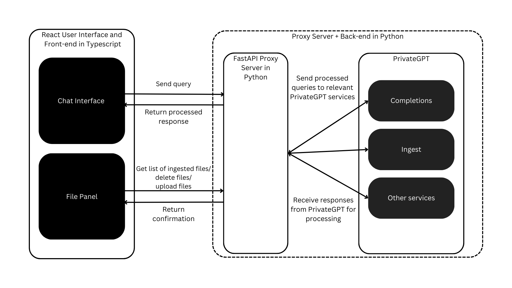

# Developer Guide

Read this guide:

1. to better understand the architecture of chatbot-v1;

2. if you are interested in using this project in your own RAG/chatbot application.

## Chatbot-v1 Architecture

Chatbot-v1 ties together 2 different projects:

1. [React-Chatbot-Kit](https://fredrikoseberg.github.io/react-chatbot-kit-docs/) [this project is no longer being updated]

2. [PrivateGPT](https://github.com/zylon-ai/private-gpt)

Using a simple [proxy server](https://github.com/JerryO3/chatbot-proxy-server.git) that:

1. Routes requests from the front-end to the appropriate endpoint

2. Processes responses from the PrivateGPT server into an appropriate format for the front-end.

This architecture allows for preprocessing of documents prior to ingestion to improve the effectiveness of document parsing by PrivateGPT, and accomodates for changes at the back-end so that no changes need to affect the UI directly; response processing can be performed by the proxy server in python instead of in the React front-end in Typescript. This ensures that minimal processing is done by the webpage.

### UI

### Proxy Server

The proxy server currently only has 4 endpoints:

1. `/get-file-list/` is called by the File Panel

### PrivateGPT

Chatbot-v1 does not make any changes to the PrivateGPT repo. However, configurations to the chatbot that can be done here are not limited to:

1. Changing the model
2. Changing the context window size
3. Changing the number of references

Since this project is still under active development, the goal of Chatbot-v1 is to accomodate for the latest changes on PrivateGPT, which is why directly modifying this component is avoided.

See the PrivateGPT Documentation [here](https://docs.privategpt.dev/overview/welcome/introduction).
