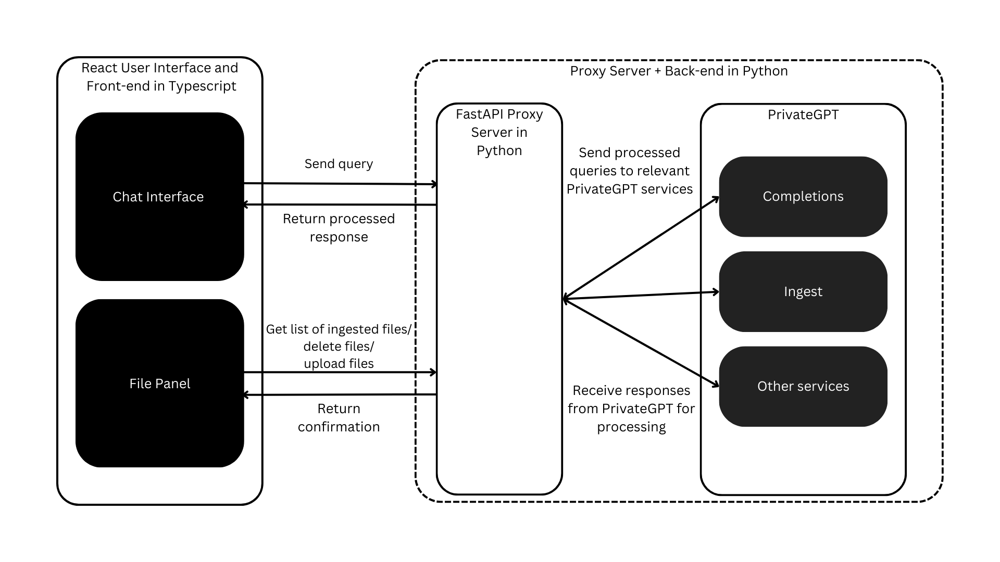
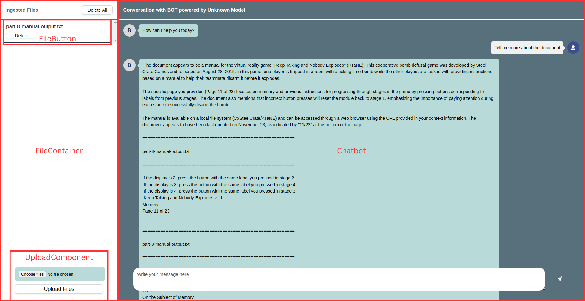
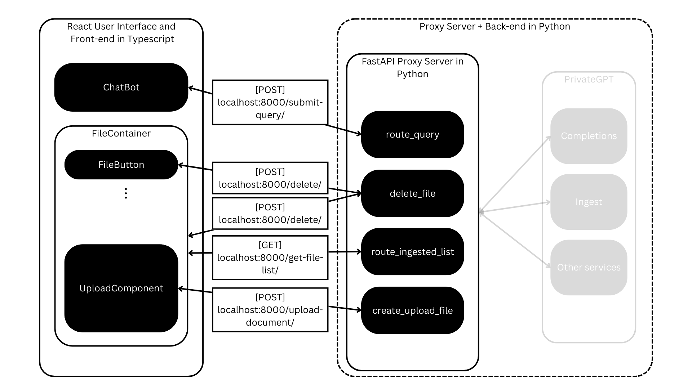
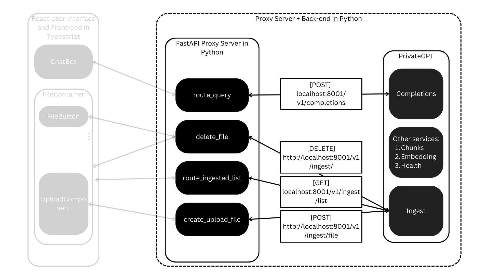

# Developer Guide

Read this guide:

1. to better understand the architecture of chatbot-v1;

2. if you are interested in using this project in your own RAG/chatbot application.

## Chatbot-v1 Architecture

Chatbot-v1 ties together 2 different projects:

1. [React-Chatbot-Kit](https://fredrikoseberg.github.io/react-chatbot-kit-docs/) [this project is no longer being updated]

2. [PrivateGPT](https://github.com/zylon-ai/private-gpt)

Using a simple [proxy server](https://github.com/JerryO3/chatbot-proxy-server.git) that:

1. Routes requests from the front-end to the appropriate endpoint

2. Processes responses from the PrivateGPT server into an appropriate format for the front-end.

This architecture allows for preprocessing of documents prior to ingestion to improve the effectiveness of document parsing by PrivateGPT, and accomodates for changes at the back-end so that no changes need to affect the UI directly; response processing can be performed by the proxy server in python instead of in the React front-end in Typescript. This ensures that minimal processing is done by the webpage.

### UI

The UI is a React App built using vite. It makes calls to endpoints exposed by the proxy server.

The UI comprises 2 major React Components:

1. `FileContainer` provides a user interface to upload and delete files, as well as displays currently uploaded files. `FileContainer` itself comprises 2 components: `FileButton` and `UploadComponent`:

    1. `FileButton` indicates to users that this file has been uploaded to the server. Each `FileButton` corresponds to one uploaded file. Note that each file may be split into multiple `documents` by the splitter in PrivateGPT, and deleting files entail deleting all `documents` whose document ids are associated with that file.

    2. `UploadComponent` comprises a [file input HTML element](https://developer.mozilla.org/en-US/docs/Web/HTML/Element/input/file) and a `Upload Files` button that uploads all files in the file input HTML element.

2. `Chatbot` provides a user interface to interact with the model. It is based on [my fork](https://github.com/JerryO3/react-chatbot-kit) of the [original react-chatbot-kit](https://github.com/FredrikOseberg/react-chatbot-kit) and has been packaged as a [local tarball file](https://github.com/JerryO3/my-ai-chatbot-frontend/blob/master/react-chatbot-kit-2.2.0.tgz) and included as a dependency in the [front-end](https://github.com/JerryO3/my-ai-chatbot-frontend) for convenience. Please refer directly to the [original documentation](https://fredrikoseberg.github.io/react-chatbot-kit-docs/) which is more comprehensive.

### Proxy Server

The proxy server is responsible for routing requests sent from the front-end to the relevant server end-points, and processing requests and responses. The proxy design pattern was a deliberate design choice to allow developers to more easily 1) create custom end-points without having to modify the UI or PrivateGPT server extensively and; 2) incorporate pre- and post- processing of requests and responses.

For example, chatbot-v1 currently preprocesses all pdfs into markdown using [pymu4pdfllm](https://pymupdf4llm.readthedocs.io/en/latest/) so that tables in pdf documents can be parsed.

The proxy server currently only has 4 endpoints:

1. `/get-file-list/` is called by the `FileContainer` on initial render to get a list of all files ingested by the model. It is also called on every subsequent upload/delete to the list.

2. `/submit-query/` is called by the `Chatbot` whenever a query is submitted by the user. It returns a string representing the model response.

3. `/delete/` is called by the `delete` button and `delete all` button and deletes all document ids of document fragments associated with the deleted file. It returns a confirmation object upon successful deletion.

4. `/upload-document/` is called by the `Upload Files` button and uploads all selected files in the file input component. It returns a confirmation object upon successful upload.

Below shows the routing between the proxy server and the PrivateGPT server.

### PrivateGPT

Chatbot-v1 does not make any changes to the PrivateGPT repo. However, configurations to the chatbot that can be done here are not limited to:

1. Changing the model
2. Changing the context window size
3. Changing the number of references

Since this project is still under active development, the goal of Chatbot-v1 is to accomodate for the latest changes on PrivateGPT, which is why directly modifying this component is avoided.

See the PrivateGPT Documentation [here](https://docs.privategpt.dev/overview/welcome/introduction).
