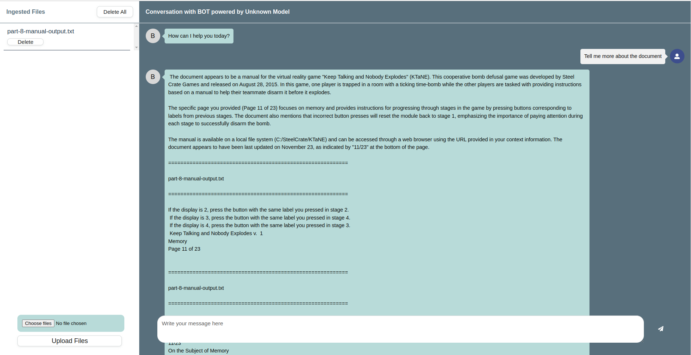

# Chatbot-v1



## What is Chatbot-v1?

Chatbot-v1 is an offline RAG front-end wrapper of [PrivateGPT](https://github.com/zylon-ai/private-gpt) for linux that can be used out of the box. It is built on:

1. [PrivateGPT](https://github.com/zylon-ai/private-gpt)

    > PrivateGPT is a production-ready AI project that allows you to ask questions about your documents using the power of Large Language Models (LLMs), even in scenarios without an Internet connection. 100% private, no data leaves your execution environment at any point. 
    
    -- PrivateGPT readme

    PrivateGPT in Chatbot-v1 is configured to use ollama, and can therefore use the latest models available on their [model library](https://ollama.com/library). The default model loaded is [mistral](https://ollama.com/library/mistral), but can be configured to any downloaded model on your ollama setup.

2. [React-Chatbot-Kit](https://fredrikoseberg.github.io/react-chatbot-kit-docs/)

    React-Chatbot-Kit is a downloadable node package that provides a ready-made chat UI. To better fit the needs of the chatbot, changes were made to some of the HTML elements in the React Components. The changes were added in [my fork of the original repo](https://github.com/JerryO3/react-chatbot-kit) and has been packaged as a local tarball file and included as a dependency in the [front-end](https://github.com/JerryO3/my-ai-chatbot-frontend) for convenience.

## How to setup/use/configure Chatbot-v1?

### Pre-requisites

* Must have `conda` installed. [Conda](https://docs.conda.io/projects/conda/en/latest/user-guide/install/linux.html) is used for to create the python environment.

### Setup Instructions

1. Clone this repo to any directory:

    ```(bash)
    git clone https://github.com/JerryO3/chatbot-v1.git
    ```

2. In the cloned `chatbot-v1` directory run the following command in your terminal:

    ```(bash)
    source setup.sh
    ```

You have successfully set up Chatbot-v1 and it is ready to use!

### Usage Instructions

1. In the cloned `chatbot-v1` directory run the following command in your terminal:

    ```(bash)
    source safe-start.sh
    ```

2. On your web browser go to the localhost port hosting the page (by default it should be set at `http://localhost:5173/`)

You can now upload documents and begin querying!

## How to uninstall Chatbot-v1?

1. In the cloned `chatbot-v1` directory run the following command in your terminal. This command removes the conda environment.

    ```(bash)
    source teardown.sh
    ```

2. Delete the `chatbot-v1` directory

3. Uninstall [Ollama](https://github.com/ollama/ollama/blob/main/docs/linux.md), [Conda](https://docs.anaconda.com/anaconda/install/uninstall/) and [Poetry](https://python-poetry.org/docs/) dependencies (if required)