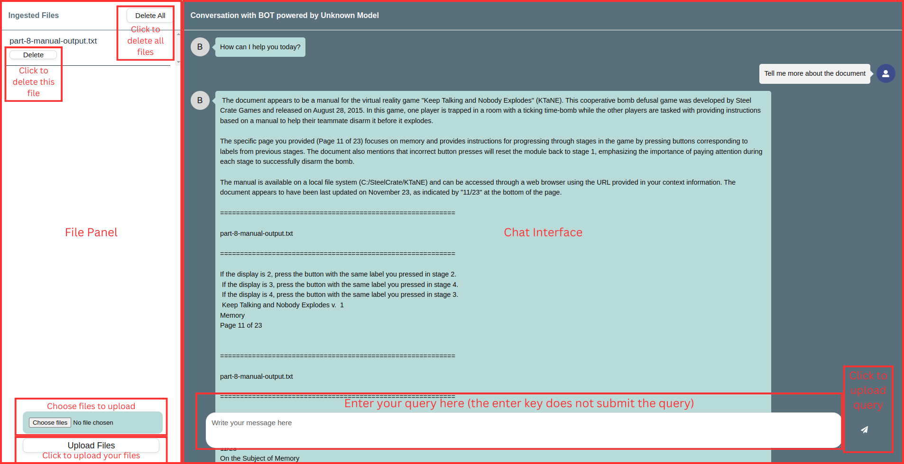

# User Guide

Read this guide to

1. Familiarise yourself with the UI

2. Get and apply suggested configurations beyond the defaults supplied by PrivateGPT

## Using Chatbot-v1



* The **File Panel** on the left can be used to:
  * Upload Files (individual or multiple files are acceptable)
  * Delete Files (individual or all files)
* The **Chat Interface** supports simple document querying through the message box below. Click on the paper plane widget to send your query.

## Editing Configurations

Chatbot-v1 uses 3 different git projects together that may be still under active development at this time of reading. This means that on update, your configurations will be reset to the defaults in the repo.

The default model used is Mistral:7b with a context window of 32k tokens. More powerful models with more parameters may be suitable for your needs.

In general, you can expect to see improved performance with a more powerful model and a larger context window.

### Changing the Model

1. Install the desired model from [ollama's model library](https://ollama.com/library):

    ```(bash)
    ollama serve
    ollama pull model-name
    ```

2. Navigate to `chatbot-v1/private-gpt/settings-ollama.yaml`

3. Change the following:

    ```(yaml)
    ollama:
        llm_model: mistral
        embedding_model: nomic-embed-text
    ```

    to your desired model(s):

    ```(yaml)
    ollama:
        llm_model: desired-model
        embedding_model: desired-embedding-model
    ```

4. Save your changes and re-run the chatbot.

* Remember to delete any unused models if you do not intend to use them anymore `ollama rm model-name`.

* Take note to check the hardware requirements of the models you intend to use.

### Changing the Context Window

1. Navigate to `chatbot-v1/private-gpt/private_gpt/server/ingest/ingest_service.py`.

2. At line 42, make the following change:

    ```(python)
    node_parser = SentenceWindowNodeParser.from_defaults()
    ```

    to

    ```(python)
    node_parser = SentenceWindowNodeParser.(window_size = <your desired window size>)
    ```

    where `<your desired window size>` is an integer referring to the number of sentences enclosing the retrieved chunk of reference text. [See this github issue](https://github.com/zylon-ai/private-gpt/issues/1917) for more information.

3. Save your changes and re-run the chatbot.

* Note that the embeddings will only reflect changes in window size on newly uploaded documents. If you want to increase the window size of existing embeddings, please delete and reupload the documents previously on the server.

* While increasing the context window can provide more informed answers, there is an upper limit to the window size, which is given by the downstream model's given maximum context window. Exceeding this window will cause errors.

### Changing the Number of References

1. Navigate to `chatbot-v1/private-gpt/private_gpt/components/vector_store/vector_store_component.py`.

2. At line 201, change the similarity_top_k value from:

    ```(python)
    similarity_top_k: int = 2,
    ```

    to your desired number of references:

    ```(python)
    similarity_top_k: int = <desired number of refs>,
    ```

    where `<desired number of refs>` represents the desired number of document sections referred to.

3. Save your changes and re-run the chatbot.
